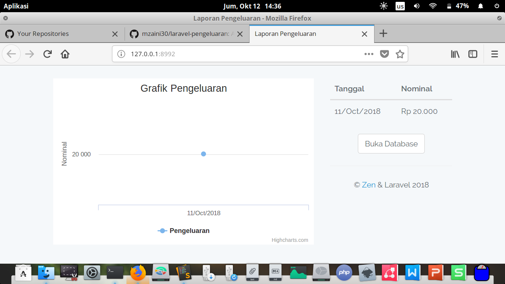

# Instalasi

Update dulu isi dari composernya:

```bash
composer update
```

Buat database `pengeluaran`.

Import database dari `database.sql`.

# Menjalankan

Jalankan servernya:

```
php artisan serve --port 8823
```